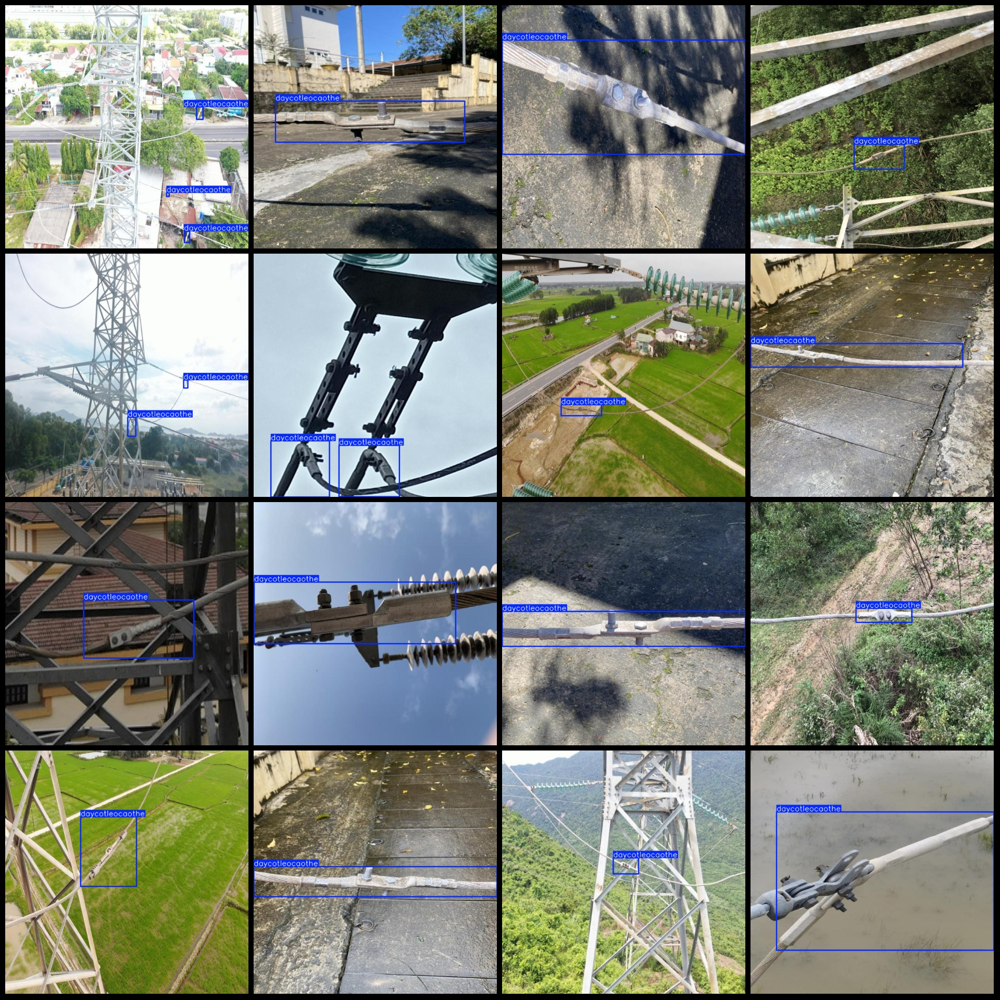
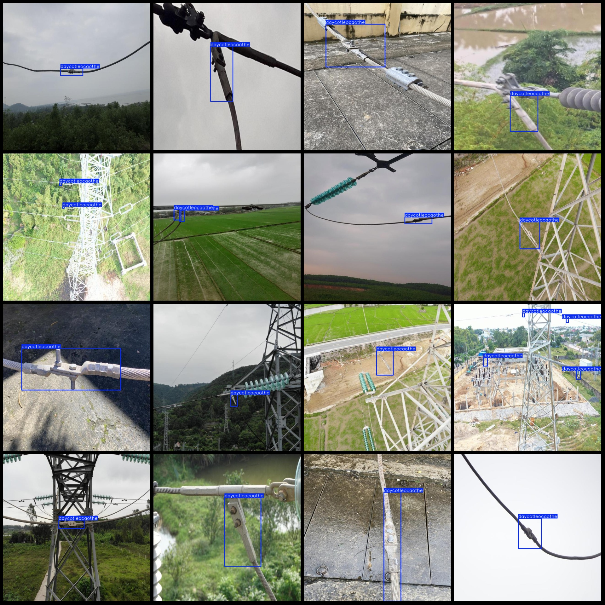

# Power Scenes: Steel Wire Connector at Metal Clip Detection Dataset - VOC+YOLO Format (1175 Images, 1 Classification)

Dataset Format: Pascal VOC format + YOLO format (without split path in txt files, only containing jpg images and corresponding VOC format xml files and yolo format txt files)
Number of Images: 1175 Images
Number of Annotations: 1175 Annotations
Number of Annotations: 1175
Number of Label Categories: 1
Label Category Name: ["daycotleocaothe"]
Number of Boxes per Category:  
daycotleocaothe Boxes = 1390
Total Boxes: 1390
Number of Images per Category:  
daycotleocaothe Images = 1175
Image Resolution: 640x640
Annotation Tool Used: labelImg
Annotation Rules: Draw a box around the category
Important Notice: The dataset does not have been split into training, validation, or test sets; you should divide it yourself.
Special Remark: This dataset does not guarantee the accuracy of trained models or weights files.
Image Preview:  
Annotation Example:

## IMAGE

Here is a pay link on Stripe ( https://buy.stripe.com/3cs8yP7sY87d0vu9AB ). Please contact me lonlonago@foxmail.com after funding $89, and I will send you a complete data files , thank you!

